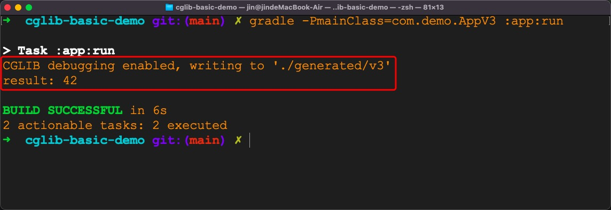
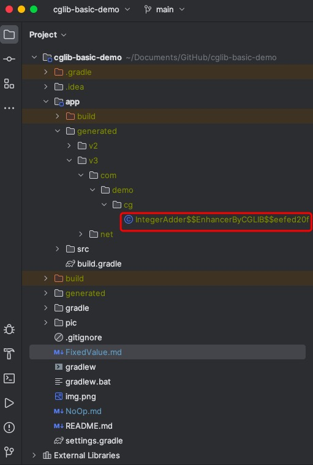

# cglib-basic-demo

## Step 4: Create a class that implements `FixedValue` interface

To make the code easier to understand,
I will create a specific `class`, 
i.e. `SimpleFixedValue` that implements `FixedValue` interface.

Its main logic is as follows

```kotlin
class SimpleFixedValue(private val value: Int) : FixedValue {
    override fun loadObject(): Int {
        return value
    }
}
```

Its full code is in [SimpleFixedValue.kt](app/src/main/kotlin/com/demo/util/SimpleFixedValue.kt)


## Step 5: Use `Enhancer` to generate a child class for `IntegerAdder`

Now we can use `Enhancer` in `cglib` to create a child `class` for `IntegerAdder`.

```kotlin
object AppV3 {

    private const val FIXED_VALUE = 42

    private const val OUTPUT_DIR = "./generated/v3"

    @JvmStatic
    fun main(args: Array<String>) {
        System.setProperty(DebuggingClassWriter.DEBUG_LOCATION_PROPERTY, OUTPUT_DIR)
        val fixedValue = SimpleFixedValue(FIXED_VALUE)
        val calculator =
            Enhancer.create(IntegerAdder::class.java, fixedValue) as IntegerAdder
        val result = calculator.add(1, 2)
        println("result: $result")
    }
}
```


Its complete code for is in
[AppV3.kt](app/src/main/kotlin/com/demo/AppV3.kt)

Let's execute the following command to run the `main` method in `AppV3`.

```bash
gradle -PmainClass=com.demo.AppV3 :app:run
```

The result is as follows.


The child class will be saved into a local file.




With the help of [IntelliJ IDEA](https://www.jetbrains.com/idea/),
we can see the decompiled result as follows.
```java
//
// Source code recreated from a .class file by IntelliJ IDEA
// (powered by FernFlower decompiler)
//

package com.demo.cg;

import net.sf.cglib.proxy.Callback;
import net.sf.cglib.proxy.Factory;
import net.sf.cglib.proxy.FixedValue;

public class IntegerAdder$$EnhancerByCGLIB$$eefed20f extends IntegerAdder implements Factory {
    private boolean CGLIB$BOUND;
    public static Object CGLIB$FACTORY_DATA;
    private static final ThreadLocal CGLIB$THREAD_CALLBACKS;
    private static final Callback[] CGLIB$STATIC_CALLBACKS;
    private FixedValue CGLIB$CALLBACK_0;
    private static Object CGLIB$CALLBACK_FILTER;

    static void CGLIB$STATICHOOK1() {
        CGLIB$THREAD_CALLBACKS = new ThreadLocal();
    }

    public final int add(int var1, int var2) {
        FixedValue var10000 = this.CGLIB$CALLBACK_0;
        if (var10000 == null) {
            CGLIB$BIND_CALLBACKS(this);
            var10000 = this.CGLIB$CALLBACK_0;
        }

        Object var3 = var10000.loadObject();
        return var3 == null ? 0 : ((Number)var3).intValue();
    }

    public final boolean equals(Object var1) {
        FixedValue var10000 = this.CGLIB$CALLBACK_0;
        if (var10000 == null) {
            CGLIB$BIND_CALLBACKS(this);
            var10000 = this.CGLIB$CALLBACK_0;
        }

        Object var2 = var10000.loadObject();
        return var2 == null ? false : (Boolean)var2;
    }

    public final String toString() {
        FixedValue var10000 = this.CGLIB$CALLBACK_0;
        if (var10000 == null) {
            CGLIB$BIND_CALLBACKS(this);
            var10000 = this.CGLIB$CALLBACK_0;
        }

        return (String)var10000.loadObject();
    }

    public final int hashCode() {
        FixedValue var10000 = this.CGLIB$CALLBACK_0;
        if (var10000 == null) {
            CGLIB$BIND_CALLBACKS(this);
            var10000 = this.CGLIB$CALLBACK_0;
        }

        Object var1 = var10000.loadObject();
        return var1 == null ? 0 : ((Number)var1).intValue();
    }

    protected final Object clone() throws CloneNotSupportedException {
        FixedValue var10000 = this.CGLIB$CALLBACK_0;
        if (var10000 == null) {
            CGLIB$BIND_CALLBACKS(this);
            var10000 = this.CGLIB$CALLBACK_0;
        }

        return var10000.loadObject();
    }

    public IntegerAdder$$EnhancerByCGLIB$$eefed20f() {
        CGLIB$BIND_CALLBACKS(this);
    }

    public static void CGLIB$SET_THREAD_CALLBACKS(Callback[] var0) {
        CGLIB$THREAD_CALLBACKS.set(var0);
    }

    public static void CGLIB$SET_STATIC_CALLBACKS(Callback[] var0) {
        CGLIB$STATIC_CALLBACKS = var0;
    }

    private static final void CGLIB$BIND_CALLBACKS(Object var0) {
        IntegerAdder$$EnhancerByCGLIB$$eefed20f var1 = (IntegerAdder$$EnhancerByCGLIB$$eefed20f)var0;
        if (!var1.CGLIB$BOUND) {
            var1.CGLIB$BOUND = true;
            Object var10000 = CGLIB$THREAD_CALLBACKS.get();
            if (var10000 == null) {
                var10000 = CGLIB$STATIC_CALLBACKS;
                if (var10000 == null) {
                    return;
                }
            }

            var1.CGLIB$CALLBACK_0 = (FixedValue)((Callback[])var10000)[0];
        }

    }

    public Object newInstance(Callback[] var1) {
        CGLIB$SET_THREAD_CALLBACKS(var1);
        IntegerAdder$$EnhancerByCGLIB$$eefed20f var10000 = new IntegerAdder$$EnhancerByCGLIB$$eefed20f();
        CGLIB$SET_THREAD_CALLBACKS((Callback[])null);
        return var10000;
    }

    public Object newInstance(Callback var1) {
        CGLIB$SET_THREAD_CALLBACKS(new Callback[]{var1});
        IntegerAdder$$EnhancerByCGLIB$$eefed20f var10000 = new IntegerAdder$$EnhancerByCGLIB$$eefed20f();
        CGLIB$SET_THREAD_CALLBACKS((Callback[])null);
        return var10000;
    }

    public Object newInstance(Class[] var1, Object[] var2, Callback[] var3) {
        CGLIB$SET_THREAD_CALLBACKS(var3);
        IntegerAdder$$EnhancerByCGLIB$$eefed20f var10000 = new IntegerAdder$$EnhancerByCGLIB$$eefed20f;
        switch (var1.length) {
            case 0:
                var10000.<init>();
                CGLIB$SET_THREAD_CALLBACKS((Callback[])null);
                return var10000;
            default:
                throw new IllegalArgumentException("Constructor not found");
        }
    }

    public Callback getCallback(int var1) {
        CGLIB$BIND_CALLBACKS(this);
        FixedValue var10000;
        switch (var1) {
            case 0:
                var10000 = this.CGLIB$CALLBACK_0;
                break;
            default:
                var10000 = null;
        }

        return var10000;
    }

    public void setCallback(int var1, Callback var2) {
        switch (var1) {
            case 0:
                this.CGLIB$CALLBACK_0 = (FixedValue)var2;
            default:
        }
    }

    public Callback[] getCallbacks() {
        CGLIB$BIND_CALLBACKS(this);
        return new Callback[]{this.CGLIB$CALLBACK_0};
    }

    public void setCallbacks(Callback[] var1) {
        this.CGLIB$CALLBACK_0 = (FixedValue)var1[0];
    }

    static {
        CGLIB$STATICHOOK1();
    }
}

```

TO BE CONTINUED
