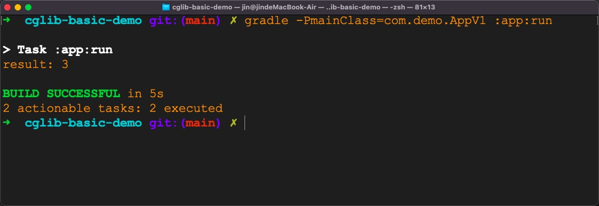

# cglib-basic-demo

## Step 1: Write some code for `IntegerAdder`

Let's write code for `IntegerAdder`.
This `class` can calculate the sum of two integer parameters.

```java
public class IntegerAdder {
    public int add(int a, int b) {
        return a + b;
    }
}
```

Its complete code is in
[IntegerAdder.java](app/src/main/java/com/demo/cg/IntegerAdder.java)

## Step 2: Create a class that implements `FixedValue` interface

To make the code easier to understand,
I will create a specific `class`, 
i.e. `SimpleFixedValue` that implements `FixedValue` interface.

Its main logic is as follows

```java
public class SimpleFixedValue implements FixedValue {

    private final int value;

    public SimpleFixedValue(int value) {
        this.value = value;
    }

    @Override
    public Object loadObject() {
        return value;
    }
}
```

Its full code is in [SimpleFixedValue.java](app/src/main/java/com/demo/util/SimpleFixedValue.java)

## Step 3: Use `Enhancer` to generate a child class for `IntegerAdder`

Now we can use `Enhancer` in `cglib` to create a child `class` for `IntegerAdder`.

```java
public class AppV1 {

    private static final int VALUE = 9876;

    public static void main(String[] args) {
        FixedValue fixedValue = new SimpleFixedValue(VALUE);

        IntegerAdder calculator =
                (IntegerAdder) Enhancer.create(IntegerAdder.class, fixedValue);

        int result = calculator.add(1, 2);
        System.out.println("result: " + result);
    }
}
```

Its complete code for is in
[AppV1.java](app/src/main/java/com/demo/AppV1.java)

Then we can run `main` method in `AppV1`.
I am using java `8`, the configuration for running `main` method in `AppV1` can be seen in the following picture.


The result is as follows



