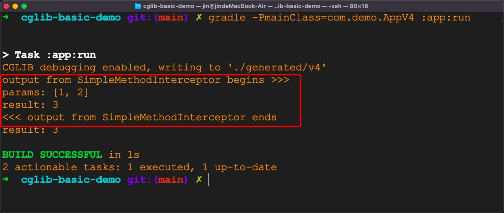

# cglib-basic-demo

Previous page: [FixedValue.md](FixedValue.md)

## Step 6: Create a class that implements `MethodInterceptor` interface

Let's create a `SimpleMethodInterceptor` class that implements `MethodInterceptor` interface. 
```kotlin
class SimpleMethodInterceptor : MethodInterceptor {
    /**
     * @param obj    "this", the enhanced object (i.e. a child class instance)
     * @param method intercepted Method
     * @param args   argument array; primitive types are wrapped
     * @param proxy  used to invoke super (non-intercepted method); may be called
     * as many times as needed
     */
    @kotlin.Throws(Throwable::class)
    override fun intercept(
        obj: Any,
        method: java.lang.reflect.Method,
        args: Array<Any>,
        proxy: net.sf.cglib.proxy.MethodProxy
    ): Any {
        // "obj" is an instance of the child class,
        // proxy.invokeSuper(...) will finally invoke corresponding method in parent class (i.e. "IntegerAdder" class)
        val result = proxy.invokeSuper(obj, args)
        println(">>> output from SimpleMethodInterceptor begins")
        println("params: " + args.contentToString())
        println("result: $result")
        println("<<< output from SimpleMethodInterceptor ends")
        return result
    }
}
```

Its complete code is in [SimpleMethodInterceptor.kt](app/src/main/kotlin/com/demo/util/SimpleMethodInterceptor.kt).

## Step 7: Use `Enhancer` to generate a child class for `IntegerAdder`
Now we can use `Enhancer` in `cglib` to create a child `class` for `IntegerAdder`.

```kotlin
object AppV4 {

    private const val OUTPUT_DIR = "./generated/v4"

    @JvmStatic
    fun main(args: Array<String>) {
        System.setProperty(DebuggingClassWriter.DEBUG_LOCATION_PROPERTY, OUTPUT_DIR)
        var methodInterceptor = SimpleMethodInterceptor()
        val calculator =
            Enhancer.create(IntegerAdder::class.java, methodInterceptor) as IntegerAdder
        val result = calculator.add(1, 2)
        println("result: $result")
    }
}
```

Its complete code for is in
[AppV4.kt](app/src/main/kotlin/com/demo/AppV4.kt)

Let's execute the following command to run the `main` method in `AppV4`.

```bash
gradle -PmainClass=com.demo.AppV4 :app:run
```

The result is as follows.


The child class will be saved into a local file.


In fact, not only the child class is saved, we also get two other class files.

Let's look a look at the decompiled version for `IntegerAdder$$EnhancerByCGLIB$$de758318` class (it is a child class for `IntegerAdder` class).
```java
//
// Source code recreated from a .class file by IntelliJ IDEA
// (powered by FernFlower decompiler)
//

package com.demo.cg;

import java.lang.reflect.Method;
import net.sf.cglib.core.ReflectUtils;
import net.sf.cglib.core.Signature;
import net.sf.cglib.proxy.Callback;
import net.sf.cglib.proxy.Factory;
import net.sf.cglib.proxy.MethodInterceptor;
import net.sf.cglib.proxy.MethodProxy;

public class IntegerAdder$$EnhancerByCGLIB$$de758318 extends IntegerAdder implements Factory {
    private boolean CGLIB$BOUND;
    public static Object CGLIB$FACTORY_DATA;
    private static final ThreadLocal CGLIB$THREAD_CALLBACKS;
    private static final Callback[] CGLIB$STATIC_CALLBACKS;
    private MethodInterceptor CGLIB$CALLBACK_0;
    private static Object CGLIB$CALLBACK_FILTER;
    private static final Method CGLIB$add$0$Method;
    private static final MethodProxy CGLIB$add$0$Proxy;
    private static final Object[] CGLIB$emptyArgs;
    private static final Method CGLIB$equals$1$Method;
    private static final MethodProxy CGLIB$equals$1$Proxy;
    private static final Method CGLIB$toString$2$Method;
    private static final MethodProxy CGLIB$toString$2$Proxy;
    private static final Method CGLIB$hashCode$3$Method;
    private static final MethodProxy CGLIB$hashCode$3$Proxy;
    private static final Method CGLIB$clone$4$Method;
    private static final MethodProxy CGLIB$clone$4$Proxy;

    static void CGLIB$STATICHOOK1() {
        CGLIB$THREAD_CALLBACKS = new ThreadLocal();
        CGLIB$emptyArgs = new Object[0];
        Class var0 = Class.forName("com.demo.cg.IntegerAdder$$EnhancerByCGLIB$$de758318");
        Class var1;
        Method[] var10000 = ReflectUtils.findMethods(new String[]{"equals", "(Ljava/lang/Object;)Z", "toString", "()Ljava/lang/String;", "hashCode", "()I", "clone", "()Ljava/lang/Object;"}, (var1 = Class.forName("java.lang.Object")).getDeclaredMethods());
        CGLIB$equals$1$Method = var10000[0];
        CGLIB$equals$1$Proxy = MethodProxy.create(var1, var0, "(Ljava/lang/Object;)Z", "equals", "CGLIB$equals$1");
        CGLIB$toString$2$Method = var10000[1];
        CGLIB$toString$2$Proxy = MethodProxy.create(var1, var0, "()Ljava/lang/String;", "toString", "CGLIB$toString$2");
        CGLIB$hashCode$3$Method = var10000[2];
        CGLIB$hashCode$3$Proxy = MethodProxy.create(var1, var0, "()I", "hashCode", "CGLIB$hashCode$3");
        CGLIB$clone$4$Method = var10000[3];
        CGLIB$clone$4$Proxy = MethodProxy.create(var1, var0, "()Ljava/lang/Object;", "clone", "CGLIB$clone$4");
        CGLIB$add$0$Method = ReflectUtils.findMethods(new String[]{"add", "(II)I"}, (var1 = Class.forName("com.demo.cg.IntegerAdder")).getDeclaredMethods())[0];
        CGLIB$add$0$Proxy = MethodProxy.create(var1, var0, "(II)I", "add", "CGLIB$add$0");
    }

    final int CGLIB$add$0(int var1, int var2) {
        return super.add(var1, var2);
    }

    public final int add(int var1, int var2) {
        MethodInterceptor var10000 = this.CGLIB$CALLBACK_0;
        if (var10000 == null) {
            CGLIB$BIND_CALLBACKS(this);
            var10000 = this.CGLIB$CALLBACK_0;
        }

        if (var10000 != null) {
            Object var3 = var10000.intercept(this, CGLIB$add$0$Method, new Object[]{new Integer(var1), new Integer(var2)}, CGLIB$add$0$Proxy);
            return var3 == null ? 0 : ((Number)var3).intValue();
        } else {
            return super.add(var1, var2);
        }
    }

    final boolean CGLIB$equals$1(Object var1) {
        return super.equals(var1);
    }

    public final boolean equals(Object var1) {
        MethodInterceptor var10000 = this.CGLIB$CALLBACK_0;
        if (var10000 == null) {
            CGLIB$BIND_CALLBACKS(this);
            var10000 = this.CGLIB$CALLBACK_0;
        }

        if (var10000 != null) {
            Object var2 = var10000.intercept(this, CGLIB$equals$1$Method, new Object[]{var1}, CGLIB$equals$1$Proxy);
            return var2 == null ? false : (Boolean)var2;
        } else {
            return super.equals(var1);
        }
    }

    final String CGLIB$toString$2() {
        return super.toString();
    }

    public final String toString() {
        MethodInterceptor var10000 = this.CGLIB$CALLBACK_0;
        if (var10000 == null) {
            CGLIB$BIND_CALLBACKS(this);
            var10000 = this.CGLIB$CALLBACK_0;
        }

        return var10000 != null ? (String)var10000.intercept(this, CGLIB$toString$2$Method, CGLIB$emptyArgs, CGLIB$toString$2$Proxy) : super.toString();
    }

    final int CGLIB$hashCode$3() {
        return super.hashCode();
    }

    public final int hashCode() {
        MethodInterceptor var10000 = this.CGLIB$CALLBACK_0;
        if (var10000 == null) {
            CGLIB$BIND_CALLBACKS(this);
            var10000 = this.CGLIB$CALLBACK_0;
        }

        if (var10000 != null) {
            Object var1 = var10000.intercept(this, CGLIB$hashCode$3$Method, CGLIB$emptyArgs, CGLIB$hashCode$3$Proxy);
            return var1 == null ? 0 : ((Number)var1).intValue();
        } else {
            return super.hashCode();
        }
    }

    final Object CGLIB$clone$4() throws CloneNotSupportedException {
        return super.clone();
    }

    protected final Object clone() throws CloneNotSupportedException {
        MethodInterceptor var10000 = this.CGLIB$CALLBACK_0;
        if (var10000 == null) {
            CGLIB$BIND_CALLBACKS(this);
            var10000 = this.CGLIB$CALLBACK_0;
        }

        return var10000 != null ? var10000.intercept(this, CGLIB$clone$4$Method, CGLIB$emptyArgs, CGLIB$clone$4$Proxy) : super.clone();
    }

    public static MethodProxy CGLIB$findMethodProxy(Signature var0) {
        String var10000 = var0.toString();
        switch (var10000.hashCode()) {
            case -1287932281:
                if (var10000.equals("add(II)I")) {
                    return CGLIB$add$0$Proxy;
                }
                break;
            case -508378822:
                if (var10000.equals("clone()Ljava/lang/Object;")) {
                    return CGLIB$clone$4$Proxy;
                }
                break;
            case 1826985398:
                if (var10000.equals("equals(Ljava/lang/Object;)Z")) {
                    return CGLIB$equals$1$Proxy;
                }
                break;
            case 1913648695:
                if (var10000.equals("toString()Ljava/lang/String;")) {
                    return CGLIB$toString$2$Proxy;
                }
                break;
            case 1984935277:
                if (var10000.equals("hashCode()I")) {
                    return CGLIB$hashCode$3$Proxy;
                }
        }

        return null;
    }

    public IntegerAdder$$EnhancerByCGLIB$$de758318() {
        CGLIB$BIND_CALLBACKS(this);
    }

    public static void CGLIB$SET_THREAD_CALLBACKS(Callback[] var0) {
        CGLIB$THREAD_CALLBACKS.set(var0);
    }

    public static void CGLIB$SET_STATIC_CALLBACKS(Callback[] var0) {
        CGLIB$STATIC_CALLBACKS = var0;
    }

    private static final void CGLIB$BIND_CALLBACKS(Object var0) {
        IntegerAdder$$EnhancerByCGLIB$$de758318 var1 = (IntegerAdder$$EnhancerByCGLIB$$de758318)var0;
        if (!var1.CGLIB$BOUND) {
            var1.CGLIB$BOUND = true;
            Object var10000 = CGLIB$THREAD_CALLBACKS.get();
            if (var10000 == null) {
                var10000 = CGLIB$STATIC_CALLBACKS;
                if (var10000 == null) {
                    return;
                }
            }

            var1.CGLIB$CALLBACK_0 = (MethodInterceptor)((Callback[])var10000)[0];
        }

    }

    public Object newInstance(Callback[] var1) {
        CGLIB$SET_THREAD_CALLBACKS(var1);
        IntegerAdder$$EnhancerByCGLIB$$de758318 var10000 = new IntegerAdder$$EnhancerByCGLIB$$de758318();
        CGLIB$SET_THREAD_CALLBACKS((Callback[])null);
        return var10000;
    }

    public Object newInstance(Callback var1) {
        CGLIB$SET_THREAD_CALLBACKS(new Callback[]{var1});
        IntegerAdder$$EnhancerByCGLIB$$de758318 var10000 = new IntegerAdder$$EnhancerByCGLIB$$de758318();
        CGLIB$SET_THREAD_CALLBACKS((Callback[])null);
        return var10000;
    }

    public Object newInstance(Class[] var1, Object[] var2, Callback[] var3) {
        CGLIB$SET_THREAD_CALLBACKS(var3);
        IntegerAdder$$EnhancerByCGLIB$$de758318 var10000 = new IntegerAdder$$EnhancerByCGLIB$$de758318;
        switch (var1.length) {
            case 0:
                var10000.<init>();
                CGLIB$SET_THREAD_CALLBACKS((Callback[])null);
                return var10000;
            default:
                throw new IllegalArgumentException("Constructor not found");
        }
    }

    public Callback getCallback(int var1) {
        CGLIB$BIND_CALLBACKS(this);
        MethodInterceptor var10000;
        switch (var1) {
            case 0:
                var10000 = this.CGLIB$CALLBACK_0;
                break;
            default:
                var10000 = null;
        }

        return var10000;
    }

    public void setCallback(int var1, Callback var2) {
        switch (var1) {
            case 0:
                this.CGLIB$CALLBACK_0 = (MethodInterceptor)var2;
            default:
        }
    }

    public Callback[] getCallbacks() {
        CGLIB$BIND_CALLBACKS(this);
        return new Callback[]{this.CGLIB$CALLBACK_0};
    }

    public void setCallbacks(Callback[] var1) {
        this.CGLIB$CALLBACK_0 = (MethodInterceptor)var1[0];
    }

    static {
        CGLIB$STATICHOOK1();
    }
}
```

The `add` method has several lines of code.
```java
public final int add(int var1, int var2) {
    MethodInterceptor var10000 = this.CGLIB$CALLBACK_0;
    if (var10000 == null) {
        CGLIB$BIND_CALLBACKS(this);
        var10000 = this.CGLIB$CALLBACK_0;
    }

    if (var10000 != null) {
        Object var3 = var10000.intercept(this, CGLIB$add$0$Method, new Object[]{new Integer(var1), new Integer(var2)}, CGLIB$add$0$Proxy);
        return var3 == null ? 0 : ((Number)var3).intValue();
    } else {
        return super.add(var1, var2);
    }
}
```

What is `this.CGLIB$CALLBACK_0`?
Let's add a breakpoint in line 18 in [AppV4.kt](app/src/main/kotlin/com/demo/AppV4.kt).


My configuration for debugging [AppV4.kt](app/src/main/kotlin/com/demo/AppV4.kt)
can be seen in the following picture.
.

When we pause at the breakpoint,
we can see that `this.CGLIB$CALLBACK_0` is an instance of type `SimpleMethodInterceptor`.


Based on this, I will add some comment for the `add` method.
```java
public final int add(int var1, int var2) {
    // an instance of type `SimpleMethodInterceptor`
    MethodInterceptor var10000 = this.CGLIB$CALLBACK_0;
    // if branch will not be executed in our case
    if (var10000 == null) {
        CGLIB$BIND_CALLBACKS(this);
        var10000 = this.CGLIB$CALLBACK_0;
    }

    // if branch will be executed in our case
    if (var10000 != null) {
        // the `intercept` method in `SimpleMethodInterceptor` will be invoked
        Object var3 = var10000.intercept(this, CGLIB$add$0$Method, new Object[]{new Integer(var1), new Integer(var2)}, CGLIB$add$0$Proxy);
        return var3 == null ? 0 : ((Number)var3).intValue();
    } else {
        return super.add(var1, var2);
    }
}
```

So the `intercept` method in `SimpleMethodInterceptor` will be invoked.
After some debugging, 
we will reach the code as shown in the following picture 
(details are skipped here, 
but I think it is not hard to find the code).


So what is `fci.f2` and `fci.i2`?
Let's take a closer look now.


`fci.f2` is an instance of type `com.demo.cg.IntegerAdder$$EnhancerByCGLIB$$de758318$$FastClassByCGLIB$$c97d762b` (**please note that you might see a different name when you debug**).
We can think of it as a `FastClass` for the child class of `IntegerAdder` class.
`fci.i2` is `3` (**please note that you might see a different number when you debug**).

Since the byte code for `com.demo.cg.IntegerAdder$$EnhancerByCGLIB$$de758318$$FastClassByCGLIB$$c97d762b` will be saved to a local file,
let me copy the decompiled content as follows (some content is omitted).

```java
//
// Source code recreated from a .class file by IntelliJ IDEA
// (powered by FernFlower decompiler)
//

package com.demo.cg;

import com.demo.cg.IntegerAdder..EnhancerByCGLIB..de758318;
import java.lang.reflect.InvocationTargetException;
import net.sf.cglib.core.Signature;
import net.sf.cglib.proxy.Callback;
import net.sf.cglib.reflect.FastClass;

public class IntegerAdder$$EnhancerByCGLIB$$de758318$$FastClassByCGLIB$$c97d762b extends FastClass {
    public IntegerAdder$$EnhancerByCGLIB$$de758318$$FastClassByCGLIB$$c97d762b(Class var1) {
        super(var1);
    }

    public int getIndex(Signature var1) {
        String var10000 = var1.toString();
        switch (var10000.hashCode()) {
            case -2055565910:
                ...
            case -1882565338:
                ...
            case -1457535688:
                ...
            case -1411842725:
                ...
            case -1287932281:
                if (var10000.equals("add(II)I")) {
                    return 13;
                }
                break;
            case -984241474:
                if (var10000.equals("CGLIB$add$0(II)I")) {
                    return 3;
                }
                break;
            // Some other cases are omitted here
                ...
        }

        return -1;
    }

    public int getIndex(String var1, Class[] var2) {
        switch (var1.hashCode()) {
            case -1776922004:
                ...
            case -1295482945:
                ...
            case -1053468136:
                ...
            case -124978609:
                ...
            case -60403779:
                ...
            case -29025555:
                ...
            case 96417:
                if (var1.equals("add")) {
                    switch (var2.length) {
                        case 2:
                            if (var2[0].getName().equals("int") && var2[1].getName().equals("int")) {
                                return 13;
                            }
                    }
                }
                break;
            case 85179481:
                ...
            case 94756189:
                ...
            case 147696667:
                ...
            case 161998109:
                ...
            case 495524492:
                ...
            case 1108311562:
                if (var1.equals("CGLIB$add$0")) {
                    switch (var2.length) {
                        case 2:
                            if (var2[0].getName().equals("int") && var2[1].getName().equals("int")) {
                                return 3;
                            }
                    }
                }
                break;
            case 1154623345:
                ...
            // Some other cases are omitted here
                ...
        }

        return -1;
    }

    public int getIndex(Class[] var1) {
        switch (var1.length) {
            case 0:
                return 0;
            default:
                return -1;
        }
    }

    public Object invoke(int var1, Object var2, Object[] var3) throws InvocationTargetException {
        IntegerAdder..EnhancerByCGLIB..de758318 var10000 = (IntegerAdder..EnhancerByCGLIB..de758318)var2;
        int var10001 = var1;

        try {
            switch (var10001) {
                case 0:
                    ...
                case 1:
                    ...
                case 2:
                    ...
                case 3:
                    return new Integer(var10000.CGLIB$add$0(((Number)var3[0]).intValue(), ((Number)var3[1]).intValue()));
                case 4:
                    ...
                // a lot of other cases omitted here
                    ...    
            }
        } catch (Throwable var4) {
            throw new InvocationTargetException(var4);
        }

        throw new IllegalArgumentException("Cannot find matching method/constructor");
    }

    public Object newInstance(int var1, Object[] var2) throws InvocationTargetException {
        ...
    }

    public int getMaxIndex() {
        return 20;
    }
}

```

It seems that the key idea for `IntegerAdder$$EnhancerByCGLIB$$de758318$$FastClassByCGLIB$$c97d762b`
is to provide a way to invoke methods in `IntegerAdder$$EnhancerByCGLIB$$de758318` without using reflection.

Since `var1` is equal to `3` for the `invoke(...)` method in `IntegerAdder$$EnhancerByCGLIB$$de758318$$FastClassByCGLIB$$c97d762b`,
the `CGLIB$add$0` method in `IntegerAdder$$EnhancerByCGLIB$$de758318` will be invoked.
The code for `CGLIB$add$0` method in `IntegerAdder$$EnhancerByCGLIB$$de758318` can be seen as follows. 

```java
    final int CGLIB$add$0(int var1, int var2) {
        return super.add(var1, var2);
    }
```

Since `IntegerAdder$$EnhancerByCGLIB$$de758318` class is a subclass for `IntegerAdder` class,
`super.add(var1, var2)` will call the `add(...)` method in `IntegerAdder`.

TO BE CONTINUED