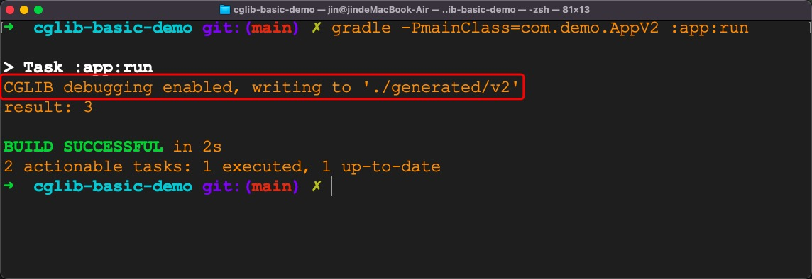
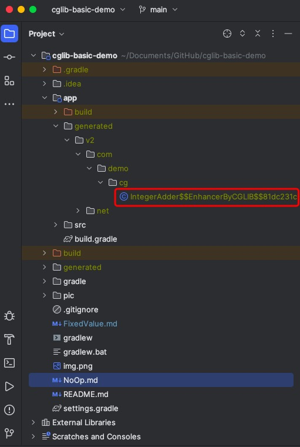

# cglib-basic-demo

## Step 1: Write some code for `IntegerAdder`

Let's write code for `IntegerAdder`.
This `class` can calculate the sum of two integer parameters.

```kotlin
open class IntegerAdder {
    open fun add(a: Int, b: Int): Int {
        return a + b
    }
}
```

Its complete code is in
[IntegerAdder.kt](app/src/main/kotlin/com/demo/cg/IntegerAdder.kt)


## Step 2: Use `Enhancer` and `NoOp` to generate a child class for `IntegerAdder`

Now we can use `Enhancer` and `NoOp` in `cglib` to create a child `class` for `IntegerAdder`.

```kotlin
object AppV1 {
    @JvmStatic
    fun main(args: Array<String>) {
        val noOp = NoOp.INSTANCE
        val calculator =
            Enhancer.create(IntegerAdder::class.java, noOp) as IntegerAdder
        val result = calculator.add(1, 2)
        println("result: $result")
    }
}
```

Its complete code is in
[AppV1.kt](app/src/main/kotlin/com/demo/AppV1.kt)

To run the `main` method in `AppV1`, 
just execute the following command in the root directory of this project.
```bash
gradle -PmainClass=com.demo.AppV1 :app:run
```

The result is as follows


## Step 3: What does the child class look like?
In step 2, `Enhancer` helps us create a child class for `IntegerAdder`.
But what does this child class look like?
The following line can dump the child class inside a specified path.
```kotlin
System.setProperty(DebuggingClassWriter.DEBUG_LOCATION_PROPERTY, "${some specified path}")
```

Since I don't want to change the code in `AppV1`, 
let's create another file, i.e. [AppV2.kt](app/src/main/kotlin/com/demo/AppV2.kt).
```kotlin
object AppV2 {
    private const val OUTPUT_DIR = "./generated/v2"

    @JvmStatic
    fun main(args: Array<String>) {
        System.setProperty(DebuggingClassWriter.DEBUG_LOCATION_PROPERTY, OUTPUT_DIR)
        val noOp = NoOp.INSTANCE
        val calculator =
            Enhancer.create(IntegerAdder::class.java, noOp) as IntegerAdder
        val result = calculator.add(1, 2)
        println("result: $result")
    }
}
```

Please execute the following command to run the `main` method in `AppV2`.

```bash
gradle -PmainClass=com.demo.AppV2 :app:run
```

The result is as follows.


We can see that a class file is generated in the specified path as expected.


With the help of [IntelliJ IDEA](https://www.jetbrains.com/idea/),
we can see the decompiled result as follows.
```java
//
// Source code recreated from a .class file by IntelliJ IDEA
// (powered by FernFlower decompiler)
//

package com.demo.cg;

import net.sf.cglib.proxy.Callback;
import net.sf.cglib.proxy.Factory;
import net.sf.cglib.proxy.NoOp;

public class IntegerAdder$$EnhancerByCGLIB$$81dc231c extends IntegerAdder implements Factory {
    private boolean CGLIB$BOUND;
    public static Object CGLIB$FACTORY_DATA;
    private static final ThreadLocal CGLIB$THREAD_CALLBACKS;
    private static final Callback[] CGLIB$STATIC_CALLBACKS;
    private NoOp CGLIB$CALLBACK_0;
    private static Object CGLIB$CALLBACK_FILTER;

    static void CGLIB$STATICHOOK1() {
        CGLIB$THREAD_CALLBACKS = new ThreadLocal();
    }

    public IntegerAdder$$EnhancerByCGLIB$$81dc231c() {
        CGLIB$BIND_CALLBACKS(this);
    }

    public static void CGLIB$SET_THREAD_CALLBACKS(Callback[] var0) {
        CGLIB$THREAD_CALLBACKS.set(var0);
    }

    public static void CGLIB$SET_STATIC_CALLBACKS(Callback[] var0) {
        CGLIB$STATIC_CALLBACKS = var0;
    }

    private static final void CGLIB$BIND_CALLBACKS(Object var0) {
        IntegerAdder$$EnhancerByCGLIB$$81dc231c var1 = (IntegerAdder$$EnhancerByCGLIB$$81dc231c)var0;
        if (!var1.CGLIB$BOUND) {
            var1.CGLIB$BOUND = true;
            Object var10000 = CGLIB$THREAD_CALLBACKS.get();
            if (var10000 == null) {
                var10000 = CGLIB$STATIC_CALLBACKS;
                if (var10000 == null) {
                    return;
                }
            }

            var1.CGLIB$CALLBACK_0 = (NoOp)((Callback[])var10000)[0];
        }

    }

    public Object newInstance(Callback[] var1) {
        CGLIB$SET_THREAD_CALLBACKS(var1);
        IntegerAdder$$EnhancerByCGLIB$$81dc231c var10000 = new IntegerAdder$$EnhancerByCGLIB$$81dc231c();
        CGLIB$SET_THREAD_CALLBACKS((Callback[])null);
        return var10000;
    }

    public Object newInstance(Callback var1) {
        CGLIB$SET_THREAD_CALLBACKS(new Callback[]{var1});
        IntegerAdder$$EnhancerByCGLIB$$81dc231c var10000 = new IntegerAdder$$EnhancerByCGLIB$$81dc231c();
        CGLIB$SET_THREAD_CALLBACKS((Callback[])null);
        return var10000;
    }

    public Object newInstance(Class[] var1, Object[] var2, Callback[] var3) {
        CGLIB$SET_THREAD_CALLBACKS(var3);
        IntegerAdder$$EnhancerByCGLIB$$81dc231c var10000 = new IntegerAdder$$EnhancerByCGLIB$$81dc231c;
        switch (var1.length) {
            case 0:
                var10000.<init>();
                CGLIB$SET_THREAD_CALLBACKS((Callback[])null);
                return var10000;
            default:
                throw new IllegalArgumentException("Constructor not found");
        }
    }

    public Callback getCallback(int var1) {
        CGLIB$BIND_CALLBACKS(this);
        NoOp var10000;
        switch (var1) {
            case 0:
                var10000 = this.CGLIB$CALLBACK_0;
                break;
            default:
                var10000 = null;
        }

        return var10000;
    }

    public void setCallback(int var1, Callback var2) {
        switch (var1) {
            case 0:
                this.CGLIB$CALLBACK_0 = (NoOp)var2;
            default:
        }
    }

    public Callback[] getCallbacks() {
        CGLIB$BIND_CALLBACKS(this);
        return new Callback[]{this.CGLIB$CALLBACK_0};
    }

    public void setCallbacks(Callback[] var1) {
        this.CGLIB$CALLBACK_0 = (NoOp)var1[0];
    }

    static {
        CGLIB$STATICHOOK1();
    }
}
```

We can that there is no `override` version for the `add` method in this child class.

Let's continue with [FixedValue.md](FixedValue.md).
