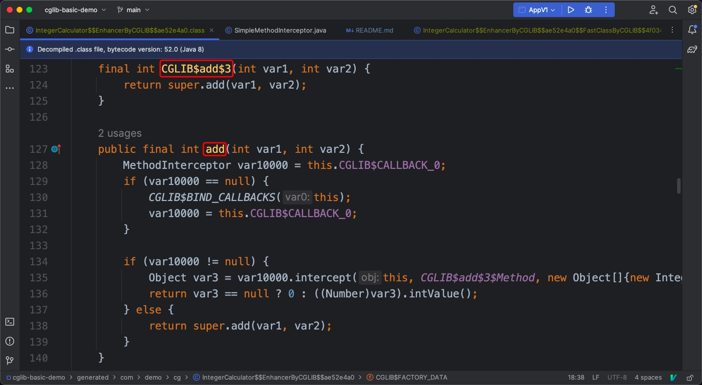
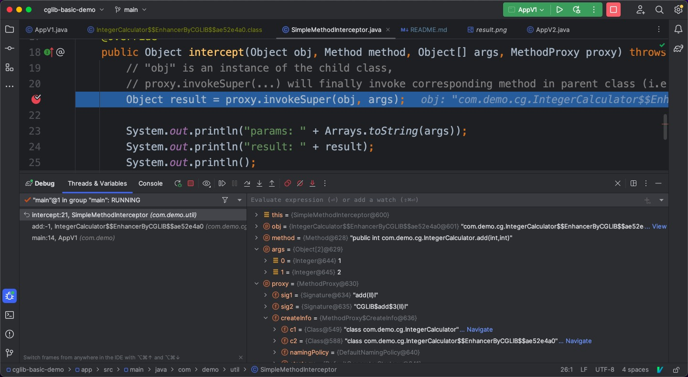
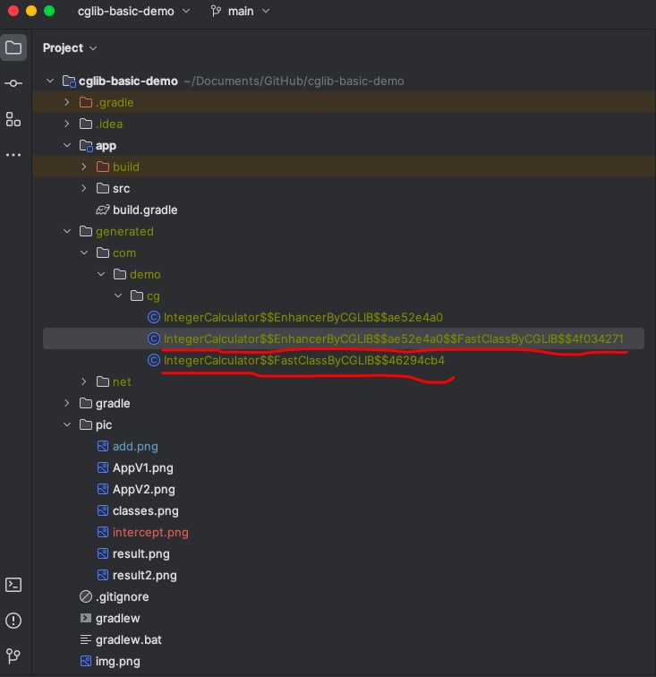

# cglib-basic-demo

I plan to write down my knowledge about [cglib](https://github.com/cglib/cglib) in this project (i.e. how `cglib`
roughly works).

You don't need to know the mechanism for `cglib` before reading this document.
But I hope you have used `cglib` several times before, since this document will not discuss stuff like "how to add cglib
in your build.gradle", "what is dynamic proxy".
If you already know a lot about `cglib`, then I think this document will not be helpful to you.

## Step 1: Write some code for `IntegerCalculator`

Let's write code for `IntegerCalculator`,
and this class is able to calculate the `+ - * /` result for two integer parameters.

```java
public class IntegerCalculator {
    public int add(int a, int b) {
        return a + b;
    }

    public int minus(int a, int b) {
        return a - b;
    }

    public int multiply(int a, int b) {
        return a * b;
    }

    public int div(int a, int b) {
        return a / b;
    }
}
```

Complete code for `IntegerCalculator` can be seen in
[IntegerCalculator.java](app/src/main/java/com/demo/cg/IntegerCalculator.java)

## Step 2: Create a class that implements `MethodInteceptor` interface

To make the code easier to understand,
I will create a specific class that implements `MethodInteceptor` interface.

Its main logic is as follows

```java
public class SimpleMethodInterceptor implements MethodInterceptor {
    /**
     * @param obj    "this", the enhanced object (i.e. a child class instance) 
     * @param method intercepted Method
     * @param args   argument array; primitive types are wrapped
     * @param proxy  used to invoke super (non-intercepted method); may be called
     *               as many times as needed
     */
    @Override
    public Object intercept(Object obj, Method method, Object[] args, MethodProxy proxy) throws Throwable {
        // "obj" is an instance of the child class,
        // proxy.invokeSuper(...) will finally invoke corresponding method in parent class (i.e. "IntegerCalculator" class)
        Object result = proxy.invokeSuper(obj, args);

        System.out.println("params: " + Arrays.toString(args));
        System.out.println("result: " + result);
        System.out.println();

        return result;
    }
}
```

Its full code is in [SimpleMethodInterceptor.java](app/src/main/java/com/demo/util/SimpleMethodInterceptor.java)

## Step 3: Use `Enhancer` to generate a child class for `IntegerCalculator`

Now we can use `Enhancer` in `cglib` to create a child class for `IntegerCalculator`.

```java
public class AppV1 {
    public static void main(String[] args) {
        MethodInterceptor interceptor = new SimpleMethodInterceptor();

        IntegerCalculator calculator =
                (IntegerCalculator) Enhancer.create(IntegerCalculator.class, interceptor);
        calculator.add(1, 2);
        calculator.minus(1, 2);
    }
}
```

Complete code for `AppV1` can be seen in
[AppV1.java](app/src/main/java/com/demo/AppV1.java)

Then we can run `main` method in `AppV1`.
I am using java 8, the configuration for running `main` method in `AppV1` can be seen in the following picture.


The result is as follows


After observing the results for running `main` method in `AppV1`,
we can draw some basic conclusions as follows.

1. `cglib` generates a child class for this parent class (i.e. the `IntegerCalculator` class).
2. The `interceptorter` variable that we created in `main` method inside `AppV1`
   seems to be able to invoke methods that are defined inside parent class.

Here comes a questions.
*Why is `intercepter` able to invoke methods in `IntegerCalculator` class (please note that `obj` is an
instance of the child class)?*

When we are inside a child class instance,
we can invoke the corresponding parent class method like this: `super.someMethod(...)`.
But `intercepter` has no inheritance relationship with `IntegerCalculator`.
So why is `cglib` able to do that?

## Step 4: Dig deeper into its mechanism

It might be helpful if we can see what the child class looks like.

Let's add the following line to dump the classes that are generated by `cglib` to local files.

```java
System.setProperty(DebuggingClassWriter.DEBUG_LOCATION_PROPERTY,"./generated");
```

To avoid changing the content of `AppV1.java`, 
I will create another file, i.e. [AppV2.java](app/src/main/java/com/demo/AppV2.java).
Its main code can be seen as follows

```java
public class AppV2 {
    public static void main(String[] args) {
        System.setProperty(DebuggingClassWriter.DEBUG_LOCATION_PROPERTY, "./generated");
        MethodInterceptor interceptor = new SimpleMethodInterceptor();

        IntegerCalculator calculator =
                (IntegerCalculator) Enhancer.create(IntegerCalculator.class, interceptor);
        calculator.add(1, 2);
        calculator.minus(1, 2);
    }
}
```

Its config can be seen as follows.


Console output are similar to that for `AppV1`


If everything work fine, you should be able to see some `class` files like this.


Let's see what's inside `IntegerCalculator$$EnhancerByCGLIB$$ae52e4a0`.
Note: the class name you get is probably different from mine,
but I think you will find a class that satisfies the following two conditions

1. `IntegerCalculator$$EnhancerByCGLIB$$` is a prefix for its name
2. Its name does not contain `FastClass`

Thanks to the help of [Intellij IDEA](https://www.jetbrains.com/idea/),
we can see its decompiled result with nearly no effort.
Since the whole content is relatively long and I think you can look at its details in your own machine,
so I only show part of its content here.


In the above picture, we can see two methods

1. `CGLIB$add$3(int var1, int var2)`
2. `public final int add(int var1, int var2)`

Inside the 1st method, we can see that the `add` method in parent class (i.e. `IntegerCalculator`) is invoked like
this: `super.add(...)`.
The 2nd method is an `override` version for the `add` method from the parent class.

So, let's take a guess here:
when we need to invoke `add` method which is defined inside the parent class,
maybe `cglib` can help us to invoke `CGLIB$add$3` in the child class?

To verify whether the above guess is correct,
we need to take a closer look into `IntegerCalculator$$EnhancerByCGLIB$$ae52e4a0`.

The full content is a little long.
I will only show the code that are directly related to the `add` method to keep the content compact.


The following if-else branch appeared inside the `add` method.

```java
if (var10000!=null) {
    Object var3=var10000.intercept(this,CGLIB$add$3$Method,new Object[]{new Integer(var1),new Integer(var2)},CGLIB$add$3$Proxy);
    return var3==null?0:((Number)var3).intValue();
} else {
    return super.add(var1,var2);
}
```

Since we have observed the console output as is shown in the following picture,

I think we can just assume the `if` branch will be executed.

The following line is inside the `if` branch.

```java
Object var3=var10000.intercept(this,CGLIB$add$3$Method,new Object[]{new Integer(var1),new Integer(var2)},CGLIB$add$3$Proxy);
```

`var10000` should be an instance of `SimpleMethodInterceptor` class.

I added a breakpoint in [SimpleMethodInterceptor.java](app/src/main/java/com/demo/util/SimpleMethodInterceptor.java).
We can take a look at the details of each parameter.


The `com.demo.util.SimpleMethodInterceptor.intercept` method has the following 4 parameters

1. `obj`: an instance of `IntegerCalculator$$EnhancerByCGLIB$$ae52e4a0` class
2. `method`: refers to `com.demo.cg.IntegerCalculator.add` method (we will not use this parameter)
3. `args`: an `Object` array that contains `1` and `2` as its content
4. `proxy`: an instance of `net.sf.cglib.proxy.MethodProxy` (we will take a closer look at this parameter later)

So the first three parameters are straight-forward,
but the last one seems to be able to handle more logic.

The `javadoc` for `net.sf.cglib.proxy.MethodProxy` is as follows.

```java
/**
 * Classes generated by {@link Enhancer} pass this object to the
 * registered {@link MethodInterceptor} objects when an intercepted method is invoked. It can
 * be used to either invoke the original method, or call the same method on a different
 * object of the same type.
 * @version $Id: MethodProxy.java,v 1.16 2009/01/11 20:09:48 herbyderby Exp $
 */
```

It contains a nested static class, i.e. `FastClassInfo`.

```java
private static class FastClassInfo {
    FastClass f1;
    FastClass f2;
    int i1;
    int i2;
}
```

Since I have read some materials from "9.1 cglib动态代理原理分析" in [深入理解JVM字节码](https://book.douban.com/subject/35079283/),
I will show the conclusions here directly.

1. `f1` is an instance of `FastClass`, it is related to child class
2. `f2` is an instance of `FastClass`, it is related to parent class
3. `i1` is related to a specific method in child class
4. `i2` is related to a specific method in parent class

Let's take a look at two important methods inside `MethodProxy`.

```java
    /**
 * Invoke the original method, on a different object of the same type.
 * @param obj the compatible object; recursion will result if you use the object passed as the first
 * argument to the MethodInterceptor (usually not what you want)
 * @param args the arguments passed to the intercepted method; you may substitute a different
 * argument array as long as the types are compatible
 * @see MethodInterceptor#intercept
 * @throws Throwable the bare exceptions thrown by the called method are passed through
 * without wrapping in an <code>InvocationTargetException</code>
 */
public Object invoke(Object obj,Object[]args) throws Throwable {
    try {
        init();
        FastClassInfo fci=fastClassInfo;
        return fci.f1.invoke(fci.i1,obj,args);
    } catch (InvocationTargetException e) {
        ... // details omitted here
    }
}

/**
 * Invoke the original (super) method on the specified object.
 * @param obj the enhanced object, must be the object passed as the first
 * argument to the MethodInterceptor
 * @param args the arguments passed to the intercepted method; you may substitute a different
 * argument array as long as the types are compatible
 * @see MethodInterceptor#intercept
 * @throws Throwable the bare exceptions thrown by the called method are passed through
 * without wrapping in an <code>InvocationTargetException</code>
 */
public Object invokeSuper(Object obj,Object[]args) throws Throwable {
    try {
        init();
        FastClassInfo fci=fastClassInfo;
        return fci.f2.invoke(fci.i2,obj,args);
    } catch (InvocationTargetException e) {
        throw e.getTargetException();
    }
}
```

For `net.sf.cglib.proxy.MethodProxy.invoke`, it returns `fci.f1.invoke(fci.i1, obj, args)`.
For `net.sf.cglib.proxy.MethodProxy.invokeSuper`, it returns `fci.f2.invoke(fci.i2, obj, args)`.

So it seems that the key point is `net.sf.cglib.reflect.FastClass.invoke(int, java.lang.Object, java.lang.Object[])`.
Since `FastClass` is an `abstract` class, where can we find its child class?

We have generated two child classes `FastClass` previously.


Let's take `IntegerCalculator$$FastClassByCGLIB$$46294cb4.class` as an example (your class name might be different from
mine, but should have similar pattern).
Since its full content is a little long,
I only show part of the content here.

```java
public class IntegerCalculator$$FastClassByCGLIB$$46294cb4 extends FastClass {

    public int getIndex(Signature var1) {
        String var10000 = var1.toString();
        switch (var10000.hashCode()) {
            case -1287932281:
                if (var10000.equals("add(II)I")) {
                    return 3;
                }
                break;
            // NOTE: some cases omitted by me here
            case 1984935277:
                if (var10000.equals("hashCode()I")) {
                    return 6;
                }
        }

        return -1;
    }

    public Object invoke(int var1, Object var2, Object[] var3) throws InvocationTargetException {
        IntegerCalculator var10000 = (IntegerCalculator) var2;
        int var10001 = var1;

        try {
            switch (var10001) {
                // NOTE: some cases omitted by me here
                case 3:
                    return new Integer(var10000.add(((Number) var3[0]).intValue(), ((Number) var3[1]).intValue()));
                // NOTE: some cases omitted by me here
                case 6:
                    return new Integer(var10000.hashCode());
            }
        } catch (Throwable var4) {
            throw new InvocationTargetException(var4);
        }

        throw new IllegalArgumentException("Cannot find matching method/constructor");
    }
}

```

In `com.demo.cg.IntegerCalculator$$EnhancerByCGLIB$$ae52e4a0$$FastClassByCGLIB$$4f034271#getIndex(net.sf.cglib.core.Signature)`,
each method (let's call it `m`) signature will be converted to a corresponding integer (just call it `num(m)` here).

In `com.demo.cg.IntegerCalculator$$FastClassByCGLIB$$46294cb4#invoke(int,Object,Object[])`,
there are three parameters

1. `int`
2. `Object`
3. `Object[]`

If the first parameter (its type is `int`) is `num(m)`,
then method `m` will be invoked (NOT by reflection api, just plain method invocation).

The key idea here is
*avoid reflection api (by Method-Integer mapping) to make the performance better*

Let's take a look at the other child class for `FastClass`, i.e. `IntegerCalculator$$EnhancerByCGLIB$$ae52e4a0$$FastClassByCGLIB$$4f034271.class`.
Only part of its content will be shown here.
```java
public class IntegerCalculator$$EnhancerByCGLIB$$ae52e4a0$$FastClassByCGLIB$$4f034271 extends FastClass {

    public int getIndex(Signature var1) {
        String var10000 = var1.toString();
        switch (var10000.hashCode()) {
            // NOTE: some cases omitted by me here
            case -1287932281:
                if (var10000.equals("add(II)I")) {
                    return 19;
                }
                break;
            case -898354021:
                if (var10000.equals("CGLIB$add$3(II)I")) {
                    return 3;
                }
                break;
            // NOTE: some cases omitted by me here
        }

        return -1;
    }


    public Object invoke(int var1, Object var2, Object[] var3) throws InvocationTargetException {
        // NOTE: this decompiler has some problem when dealing with special class names (i.e. if class name contains '$' character, then something might go wrong)
        IntegerCalculator..EnhancerByCGLIB..ae52e4a0 var10000 = (IntegerCalculator..EnhancerByCGLIB..ae52e4a0)var2;
        int var10001 = var1;

        try {
            switch (var10001) {
                // NOTE: some cases omitted by me here
                case 3:
                    return new Integer(var10000.CGLIB$add$3(((Number)var3[0]).intValue(), ((Number)var3[1]).intValue()));
                // NOTE: some cases omitted by me here
                case 19:
                    return new Integer(var10000.add(((Number)var3[0]).intValue(), ((Number)var3[1]).intValue()));
                // NOTE: some cases omitted by me here
            }
        } catch (Throwable var4) {
            throw new InvocationTargetException(var4);
        }

        throw new IllegalArgumentException("Cannot find matching method/constructor");
    }
}

```


## Step 5: Summary
Let's make a brief summary here.
If the parent class defines a method `add` (its name is not important),
then the child class will contain two corresponding methods.
1. an `add'` method (its real name might be something like `CGLIB$add$n`) that can invoke `add` method in parent class
2. an `override` version for `add`

So if we invoke `add` method with a child class instance,
then the logic chain will be like this
`child.add(...)` -> `methodIntercepter.invoke(...)` -> `methodProxy.invokeSuper(...)` -> `child.add'(...)` -> `super.add(...) (i.e. parent.add(...))`

