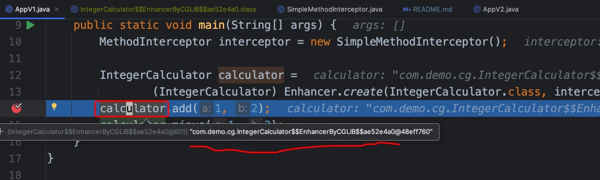

# cglib-basic-demo

I plan to write down my knowledge about [cglib](https://github.com/cglib/cglib) in this project.

## Step 1: Write some code for `IntegerCalculator`

Let's write code for `IntegerCalculator`,
and this class is able to calculate the `+ - * /` result for two integer parameters.

```java
public class IntegerCalculator {
    public int add(int a, int b) {
        return a + b;
    }

    public int minus(int a, int b) {
        return a - b;
    }

    public int multiply(int a, int b) {
        return a * b;
    }

    public int div(int a, int b) {
        return a / b;
    }
}
```

Complete code for `IntegerCalculator` can be seen in
[IntegerCalculator.java](app/src/main/java/com/demo/cg/IntegerCalculator.java)

## Step 2: Create a class that implements `MethodInteceptor` interface

To make the code easier to understand,
I will create a specific class that implements `MethodInteceptor` interface.

Its main logic is as follows

```java
public class SimpleMethodInterceptor implements MethodInterceptor {
    /**
     * @param obj    "this", the enhanced object (i.e. a child class instance) 
     * @param method intercepted Method
     * @param args   argument array; primitive types are wrapped
     * @param proxy  used to invoke super (non-intercepted method); may be called
     *               as many times as needed
     */
    @Override
    public Object intercept(Object obj, Method method, Object[] args, MethodProxy proxy) throws Throwable {
        // "obj" is an instance of the child class,
        // proxy.invokeSuper(...) will finally invoke corresponding method in parent class (i.e. "IntegerCalculator" class)
        Object result = proxy.invokeSuper(obj, args);

        System.out.println("params: " + Arrays.toString(args));
        System.out.println("result: " + result);
        System.out.println();

        return result;
    }
}
```

Its full code is in [SimpleMethodInterceptor.java](app/src/main/java/com/demo/util/SimpleMethodInterceptor.java)

## Step 3: Use `Enhancer` to generate a child class for `IntegerCalculator`
Now we can use `cglib` to create an `Enhancer` which can generate a child class for `IntegerCalculator`.
```java
public class AppV1 {
   public static void main(String[] args) {
      MethodInterceptor interceptor = new SimpleMethodInterceptor();

      IntegerCalculator calculator =
              (IntegerCalculator) Enhancer.create(IntegerCalculator.class, interceptor);
      calculator.add(1, 2);
      calculator.minus(1, 2);
   }
}
```

Complete code for `AppV1` can be seen in
[AppV1.java](app/src/main/java/com/demo/AppV1.java)

Then we can run `AppV1`.
I am using java 8, the configuration for running `main` method in `AppV1` can be seen in the following picture.


The result is as follows


After observing the results for running `main` method in `AppV1`,
we can draw some basic conclusions as follows.

1. `cglib` generates a child class for this parent class (i.e. the `IntegerCalculator` class).
2. The `interceptorter` variable that we created in `main` method inside `AppV1`
   seems to be able to invoke methods that are defined inside parent class (i.e. `IntegerCalculator` class).

Here comes a questions.
*Why is `intercepter` able to invoke methods in `IntegerCalculator` class (please note that `obj` is an
   instance of the child class)?*

When we are inside a child class instance, 
we can invoke the corresponding parent class method like this: `super.someMethod(...)`.
But `intercepter` has no inheritance relationship with `IntegerCalculator`. 
So why is `cglib` able to do that?

## Step 4: Dig deeper into its mechanism
It might be helpful if we can see what the child class looks like.

Let's add the following line to dump the classes that are generated by `cglib` to local files.

```java
System.setProperty(DebuggingClassWriter.DEBUG_LOCATION_PROPERTY,"./generated");
```

And we will get [AppV2.java](app/src/main/java/com/demo/AppV2.java).
Its main code can be seen as follows
```java
public class AppV2 {
    public static void main(String[] args) {
        System.setProperty(DebuggingClassWriter.DEBUG_LOCATION_PROPERTY, "./generated");
        MethodInterceptor interceptor = new SimpleMethodInterceptor();

        IntegerCalculator calculator =
                (IntegerCalculator) Enhancer.create(IntegerCalculator.class, interceptor);
        calculator.add(1, 2);
        calculator.minus(1, 2);
    }
}
```

Its config can be seen as follows.


Console output are similar to that for `AppV1`


If everything work fine, you should be able to see some `class` files like this. 


Let's see what's inside `IntegerCalculator$$EnhancerByCGLIB$$ae52e4a0` 
(the class name you get is probably different from mine, 
but I think you will find a class that has `IntegerCalculator$$EnhancerByCGLIB$$` as its prefix).

Thanks to the help of `Intellij IDEA`,
we can see its decompiled result with nearly no effort.
Since the whole content is relatively long and I think you can look at its details in your own machine,
so I only show part of its content here.


In the above picture, we can see two methods
1. `CGLIB$add$3(int var1, int var2)`
2. `public final int add(int var1, int var2)` 

Inside the 1st method, we can see that the add `method` in parent class (i.e. `IntegerCalculator`) is called like this: `super.add(...)`. 
The 2nd method is just an `override` version for the `add` method from the parent class.

So, let's take a guess here:
when we need to invoke `add` method which is defined inside the parent class,
maybe `cglib` can help us to invoke `CGLIB$add$3` in the child class?


TO BE CONTINUED


